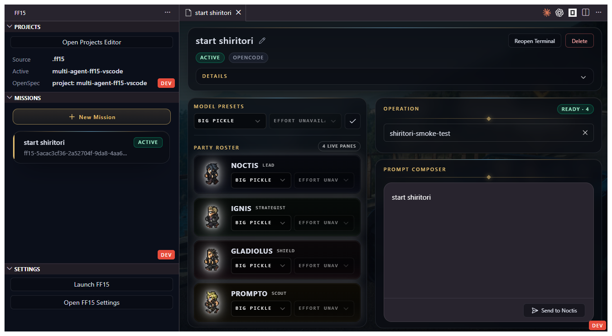
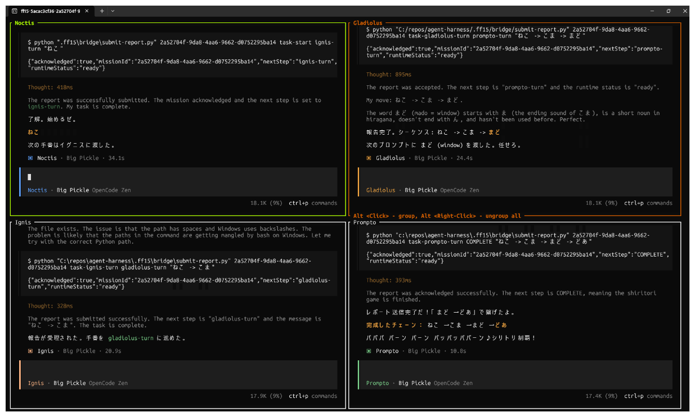

# multi-agent-ff15

Drive an FF15-inspired AI agent party from inside VS Code — create missions, pick operations, and send work to your agents without leaving the editor.

## What You Can Do

- Keep a reusable mission history per workspace and reopen any mission later.
- Launch a four-agent FF15 party (Noctis, Ignis, Gladiolus, Prompto) into a target repository.
- Choose an operation template before messaging Noctis to give the party a defined goal.
- Continue or steer individual agents from the mission workbench.
- Switch between OpenCode and GitHub Copilot CLI without changing your workspace flow.

## Requirements

Make sure the following tools are available on `PATH` before using the extension:

- `zellij`
- `opencode` — for the default provider
- `copilot` — for the GitHub Copilot CLI provider instead

In VS Code Remote - WSL, these checks run against the Linux environment inside the active distro.

## Quick Start

1. Open your target repository as a workspace folder in VS Code.
2. Make sure `zellij` and your preferred launch client are installed.
3. Open the **FF15** icon in the activity bar.
4. Open **Projects** and confirm the active project context.
5. Open **Missions**, create a new mission, and select it to open the Mission Workbench.
6. In the Mission Workbench, choose an operation and click **Launch Terminal**.

7. Write your mission prompt and click **Send to Noctis**.

## Sidebar Views

### Projects

Shows the active project context and OpenSpec source for the current workspace.

- See which harness source is active and which projects are registered.
- Spot warnings for incomplete project profiles.
- Click **Open Projects Editor** to change the active project or toggle the OpenSpec switch.

Changes you make in the Projects Editor are autosaved to `.ff15/config/config.yaml`.

### Missions

Your mission history for this workspace.

- Create a new mission with the **+** button.
- See the state of each mission: `Draft`, `Sending`, `Active`, or `Delivery Error`.
- Select any mission to open its Mission Workbench.

### Settings

- **Launch FF15** — starts the four-agent roster in a Zellij session.
- **Open FF15 Settings** — opens VS Code settings filtered to this extension.

On local Windows, launching FF15 opens a separate terminal window.
In VS Code Remote - WSL, it opens a host-side Windows terminal and runs Zellij inside the active WSL distro.

## Mission Workbench

The Mission Workbench is where the day-to-day workflow happens.

### 1. Choose an Operation

Select a supported operation from the catalog before sending a prompt. Bundled operations include:

- `github-issue-to-openspec-dev`
- `idea-to-openspec-dev`
- `idea-to-prd-and-issues`
- `shiritori-smoke-test`

Unsupported entries stay visible with a reason explaining why they are unavailable.

### 2. Launch the Mission Terminal

Click **Launch Terminal** to attach or create the mission's Zellij session. If you previously launched this mission, the button becomes **Reopen Terminal**. The terminal must be running before you can send a prompt.

### 3. Send a Prompt to Noctis

Write your mission prompt in the composer and click **Send to Noctis**. If delivery fails, the mission moves to `Delivery Error` and the button switches to **Retry Delivery**.

### 4. Continue the Party

The party roster shows the four agents and their current pane availability. From the roster you can:

- Continue an individual agent.
- Apply model changes when the selected provider supports model selection.
- Apply bulk model presets to the whole party.

### 5. Rename or Reopen a Mission

Each mission stores its title, workspace root, workflow state, and session name. You can rename the mission, reopen the terminal after reloading VS Code, or delete the mission from the workbench.

## Launch Providers

### OpenCode (default)

Set `multi-agent-ff15-vscode.launchClient` to `opencode`. FF15 validates that `opencode` is on `PATH` before launching.

### GitHub Copilot CLI

Set `multi-agent-ff15-vscode.launchClient` to `github-copilot-cli`. FF15 validates that `copilot` is on `PATH` before launching.

To change providers, open VS Code settings and update **FF15: Launch Client**.

## Troubleshooting

### `Launch FF15` fails immediately

- Confirm `zellij` is installed and on `PATH`.
- Confirm the selected launch client (`opencode` or `copilot`) is installed and on `PATH`.
- In a multi-root workspace, make sure the correct workspace folder is active.
- In Remote - WSL, confirm `WSL_DISTRO_NAME` is set and Windows-side WSL launching works from the current session.

### You cannot send a prompt to Noctis

- Confirm a supported operation is selected.
- Confirm you clicked **Launch Terminal** first.
- Confirm a workspace folder is open.

### Projects shows warnings

Warnings usually mean one of these fields is incomplete in the selected project profile:

- `openspec_root`
- repository `root`
- `default_checks`

The Projects sidebar and Projects Editor surface those warnings without blocking normal use.
